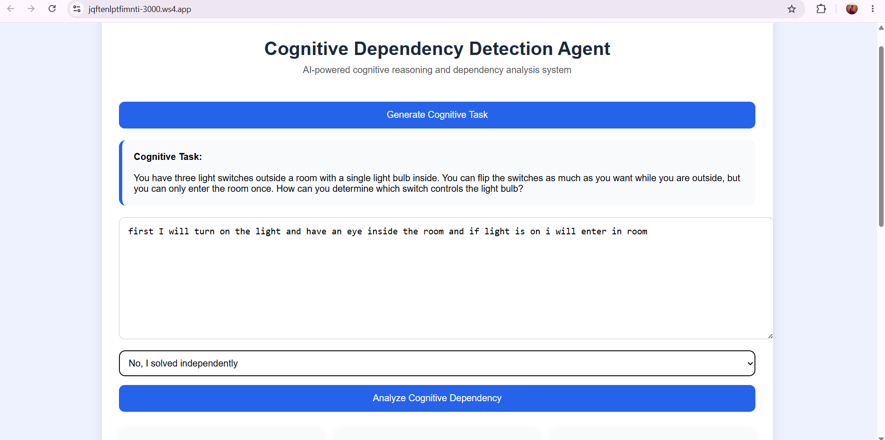
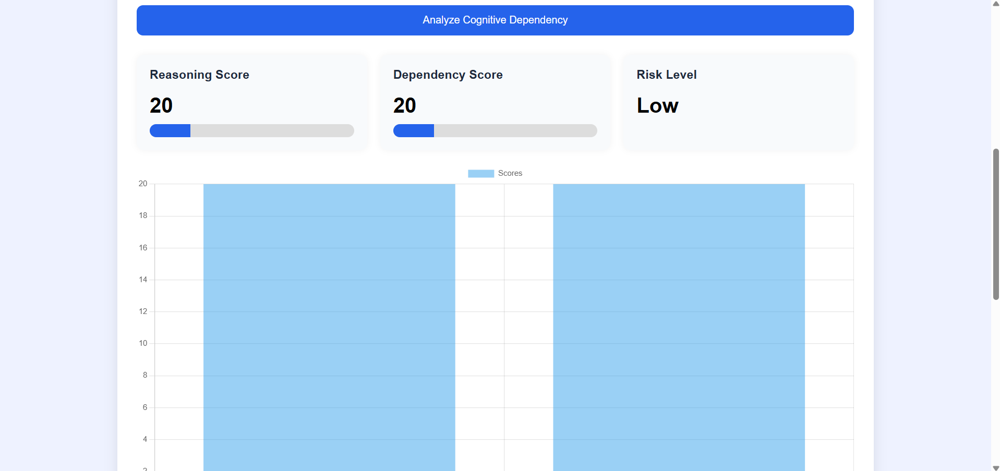
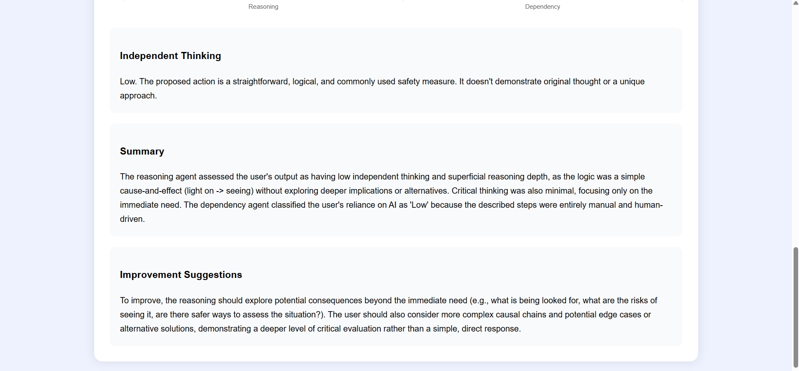

# Cognitive Dependency Detection Agent

## Overview

Cognitive Dependency Detection Agent is a Hybrid Multi-Agent AI System that analyzes human reasoning patterns and detects potential over-reliance on AI for problem solving, critical thinking, and creativity.

The application combines AI-powered cognitive analysis with rule-based scoring to evaluate reasoning quality, dependency patterns, and independent thinking.

---

## Features

* AI-generated cognitive tasks
* Reasoning quality analysis
* AI dependency detection
* Independent thinking evaluation
* Hybrid scoring system
* Risk level classification
* Improvement recommendations
* Interactive dashboard
* Progress bars and score visualization
* Chart-based analytics

---

## Screenshots

### Dashboard



### Analysis Result 1



### Analysis Result 2



---

## Multi-Agent Architecture

The system uses multiple specialized AI agents.

### Task Generation Agent

Generates cognitive challenges and reasoning tasks.

### Reasoning Agent

Evaluates logical depth, critical thinking, and reasoning quality.

### Dependency Agent

Analyzes signs of AI reliance and dependency patterns.

### Master Analysis Agent

Combines outputs from all agents and generates the final cognitive report.

---

## Technology Stack

* TypeScript
* Node.js
* Express.js
* Google Gemini AI
* HTML
* CSS
* JavaScript
* Chart.js

---

## System Architecture

```text
Frontend Dashboard
        ↓
Task Generation Agent
        ↓
Reasoning Agent
        ↓
Dependency Agent
        ↓
Master Analysis Agent
        ↓
Rule-Based Scoring Engine
        ↓
Final Cognitive Report
```

---

## Installation

### Clone Repository

```bash
git clone <repository-url>
```

### Install Dependencies

```bash
npm install
```

### Configure Environment Variables

Create a `.env` file and add:

```env
GOOGLE_GENERATIVE_AI_API_KEY=your_api_key_here
```

### Run Application

```bash
npm run dev
```

Open:

```text
http://localhost:3000
```

---

## Use Cases

* Cognitive research
* AI dependency analysis
* Educational assessment
* Critical thinking evaluation
* Human-AI interaction studies

---

## Key Outcomes

* Measures independent thinking decline
* Encourages healthier AI usage
* Supports cognition research
* Evaluates reasoning quality
* Detects potential AI dependency patterns

---

## License

This project is licensed under the MIT License.
